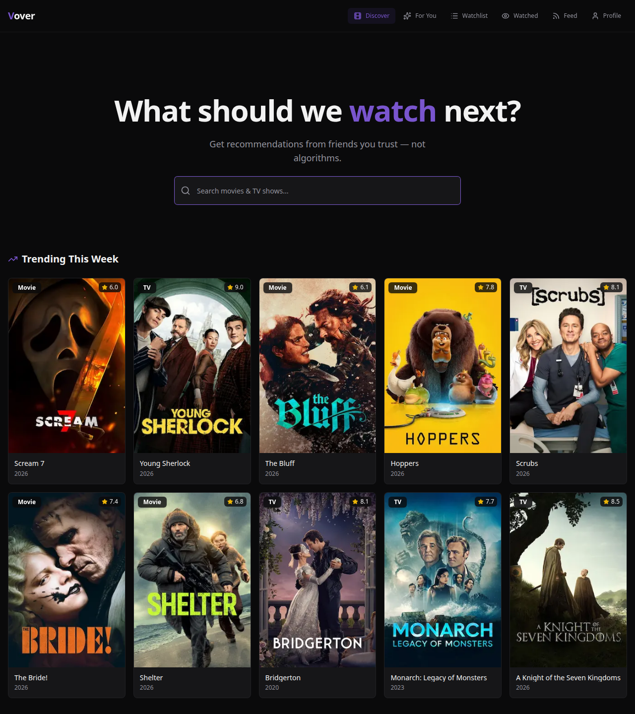
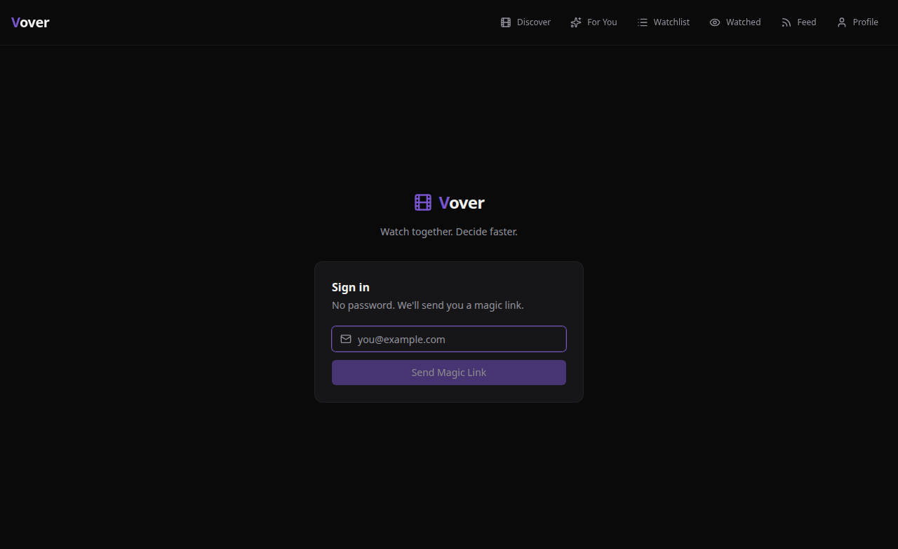

# Vover

> **Recommendations from people who actually know what you like.**

Vover is a social movie and TV tracker built around a simple idea: you trust your friends' taste more than any algorithm. Instead of endless scrolling through Netflix suggestions, Vover gives you a curated inbox of recommendations from the people you actually watch things with.



---

## The Problem

Decision fatigue is real. The average streaming platform has thousands of titles and an algorithm optimized for engagement — not for *you*. The best movie recommendations you've ever gotten didn't come from a machine. They came from a friend who said "trust me, watch this."

Vover is that friend group, structured.

---

## Features

### For You
A dedicated recommendations inbox. When a friend thinks you'll love something, they send it with a personal note. It lives here until you watch it or dismiss it — not buried in a group chat.

### Watchlist
Your personal queue, smarter. Items added from friend recommendations show who sent them, so you always remember whose taste you're trusting.

### Watched
Log what you've seen, rate it 1–5, leave notes. Your viewing history, your way.

### Feed
A real-time stream of what your friends are watching, rating, and recommending. Social proof that's actually relevant.

### Friends
Send and accept friend requests. Your recommendations are only as good as your network.

---

## Tech Stack

| Layer | Technology |
|-------|-----------|
| Framework | Next.js 14 (App Router, TypeScript) |
| Styling | Tailwind CSS + shadcn/ui |
| Icons | Lucide React |
| Auth | Supabase Auth (magic link) |
| Database | Supabase (PostgreSQL + Row Level Security) |
| Movie Data | TMDB API |
| Toasts | Sonner |
| Deployment | Vercel |

---

## Architecture

### Database Schema

```
profiles        — extends Supabase auth.users
watchlist       — user's personal queue (with recommended_by tracking)
watched         — viewing history with ratings and notes
friendships     — bidirectional friend graph (pending/accepted/rejected)
recommendations — friend-to-friend movie/TV recommendations with notes
```

Row Level Security is enabled on all tables. Users can only read/write their own data, with friendship-based policies for social features (friends can view each other's watched history).

### Key Design Decisions

- **Server Components by default** — data fetching happens on the server, minimizing client-side waterfalls
- **`@supabase/ssr`** for proper session handling via cookies across server and client components
- **TMDB key is server-only** — never exposed to the client bundle
- **Optimistic UI** — recommendation card states update instantly, DB operations happen in the background

---

## Getting Started

### Prerequisites

- Node.js 18+
- A [Supabase](https://supabase.com) project
- A [TMDB API key](https://www.themoviedb.org/settings/api) (free)

### Setup

```bash
# Clone the repo
git clone https://github.com/PeterTechDev/vover.git
cd vover

# Install dependencies
npm install

# Configure environment
cp .env.local.example .env.local
# Add your TMDB_API_KEY, NEXT_PUBLIC_SUPABASE_URL, NEXT_PUBLIC_SUPABASE_ANON_KEY

# Run the database schema
# Go to your Supabase dashboard → SQL Editor → paste supabase/schema.sql → Run

# Start the dev server
npm run dev
```

Open [http://localhost:3000](http://localhost:3000).

### Environment Variables

| Variable | Description |
|----------|-------------|
| `TMDB_API_KEY` | Free API key from TMDB (server-only) |
| `NEXT_PUBLIC_SUPABASE_URL` | Your Supabase project URL |
| `NEXT_PUBLIC_SUPABASE_ANON_KEY` | Your Supabase anon/public key |

### Supabase Auth Configuration

After deploying, add your production URL to Supabase:

> **Authentication → URL Configuration**
> - Site URL: `https://your-domain.vercel.app`
> - Redirect URL: `https://your-domain.vercel.app/auth/callback`

---

## Screenshots

| Discover | For You | Watchlist |
|----------|---------|-----------|
|  |  |  |

---

## Roadmap

- [ ] Mobile app (React Native)
- [ ] "Where to watch" — streaming availability via TMDB providers
- [ ] Taste matching — weight recommendations from friends with similar ratings
- [ ] Notification when a friend rates something you recommended
- [ ] Lists — curated collections to share with friends

---

## License

MIT

---

Built by [Peter Souza](https://github.com/PeterTechDev)
